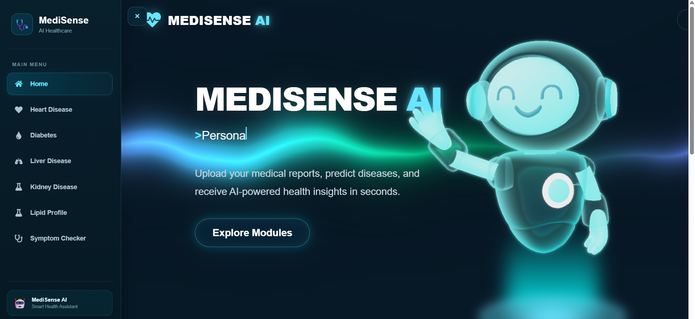
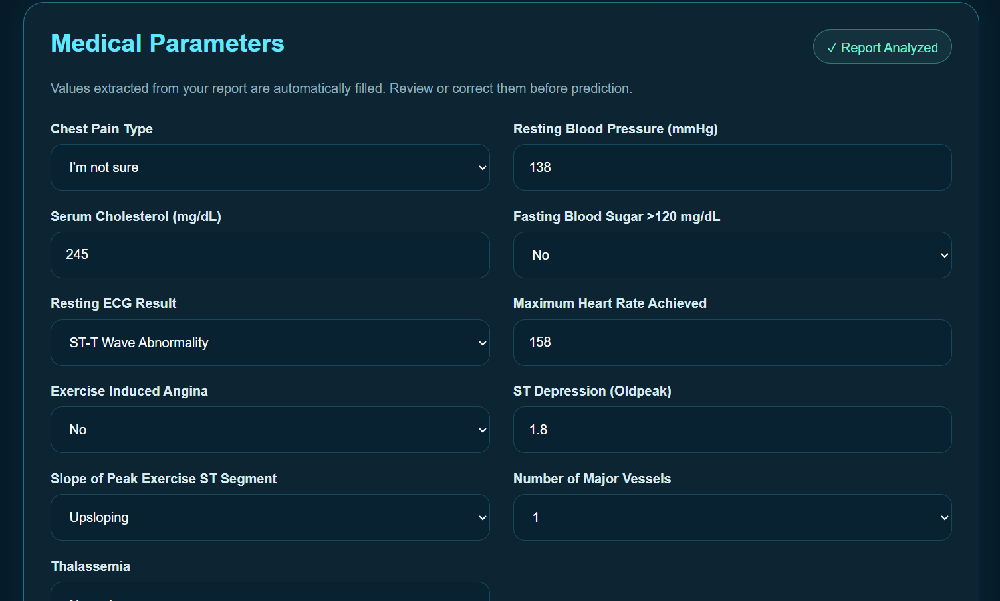
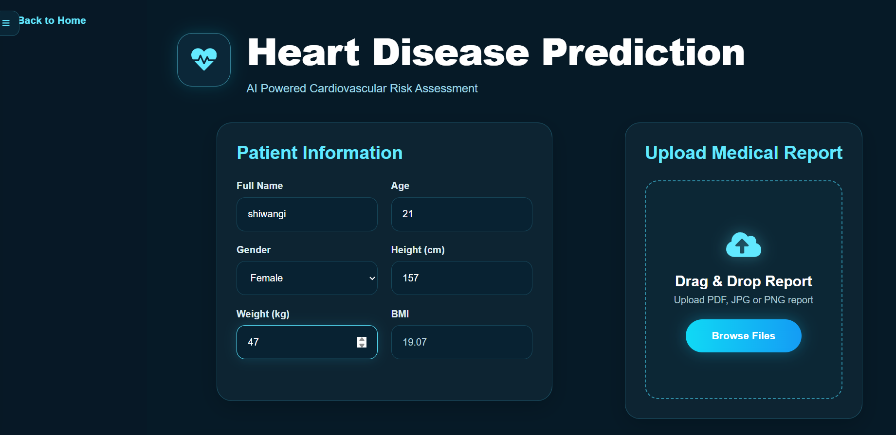
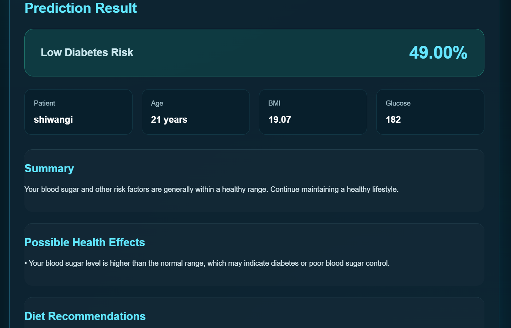
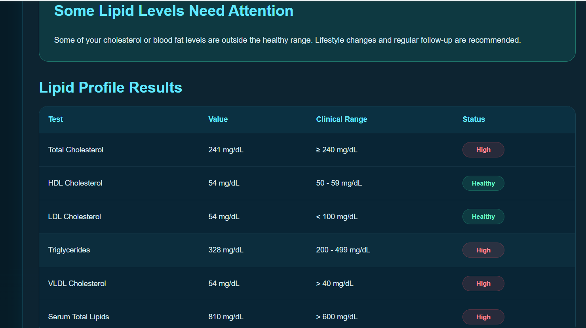
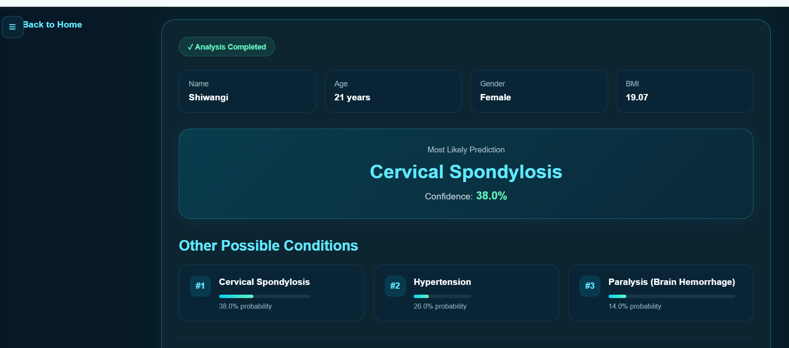
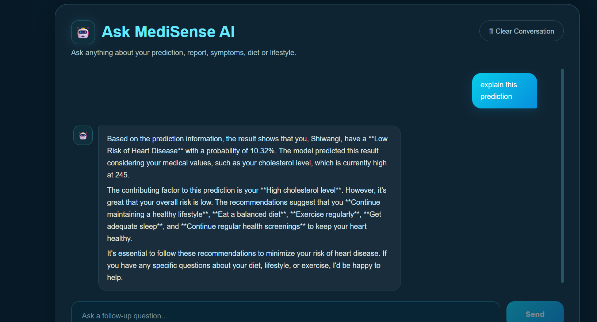
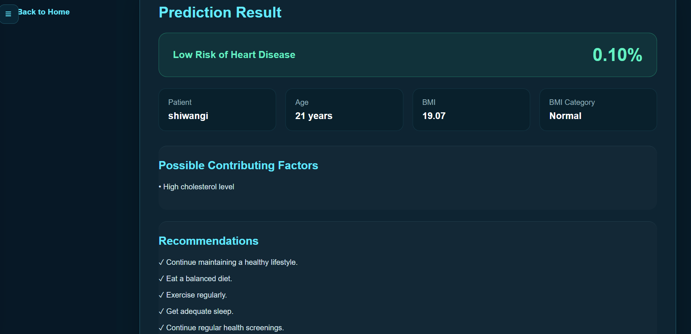

# 🩺 MediSense AI

### AI-Powered Healthcare Diagnosis & Medical Report Analysis Assistant

<p align="center">
  <b>Understand your health reports. Analyze disease risks. Get AI-powered guidance.</b>
</p>

<p align="center">
  <a href="https://medi-sense-ai-eight-nu.vercel.app/">🌐 Live Demo</a> •
  <a href="https://medisense-ai-backend-q7dk.onrender.com/docs">📚 API Documentation</a> •
  <a href="https://github.com/shiwangiedulearn-jpg/MediSense-AI">💻 GitHub</a>
</p>

---

## 📌 Overview

**MediSense AI** is a full-stack AI-powered healthcare assistance platform that combines **Machine Learning, medical report extraction, OCR, and an AI healthcare assistant** into a single application.

The system allows users to:

* Analyze disease-specific health information
* Upload medical reports
* Automatically extract relevant medical values
* Review and correct extracted values
* Generate ML-based predictions
* Calculate BMI and provide health insights
* Receive personalized lifestyle and dietary recommendations
* Ask follow-up questions to an AI healthcare assistant

The goal is to make complex medical information easier to understand for people who may not have a medical background.

> ⚠️ **Medical Disclaimer:** MediSense AI is intended for educational and informational purposes. Its predictions should not be treated as a confirmed medical diagnosis or a replacement for professional medical advice.

---

# 🌐 Live Application

### 🚀 MediSense AI

**Live Website:**
https://medi-sense-ai-eight-nu.vercel.app/

**Backend API:**
https://medisense-ai-backend-q7dk.onrender.com/

**Swagger API Documentation:**
https://medisense-ai-backend-q7dk.onrender.com/docs

---

# 🖥️ Application Preview

## 🏠 Home Dashboard



The home interface provides access to the different healthcare modules through a responsive sidebar navigation.

---

# ✨ Key Features

### 🏥 Multi-Disease Analysis

MediSense AI contains separate modules for:

* ❤️ Heart Disease
* 🩸 Diabetes
* 🫁 Liver Disease
* 🫘 Kidney Disease
* 🧪 Lipid Profile
* 🩺 Symptom Checker

Each module has its own input structure, prediction logic, and analysis workflow.

---

### 📄 Medical Report Analysis

Users can upload medical reports instead of manually entering every medical value.

Supported formats include:

* PDF
* JPG
* PNG

The system processes the uploaded document and extracts relevant medical parameters.

### Extraction Workflow

```text
Medical Report
      ↓
File Upload
      ↓
PDF / Image Processing
      ↓
OCR / Text Extraction
      ↓
Medical Value Detection
      ↓
Extracted Values
      ↓
User Review & Correction
      ↓
Disease Prediction
```

---

## 🔍 Extracted Value Review

After processing a report, extracted values are displayed for the user to verify.

Users can correct any incorrectly detected value before continuing with the analysis.



For example, the Lipid Profile module can extract values such as:

* Total Cholesterol
* LDL Cholesterol
* HDL Cholesterol
* VLDL Cholesterol
* Triglycerides
* Serum Total Lipids

---

# 🧠 Machine Learning Disease Prediction

MediSense AI uses disease-specific machine learning models rather than relying on a single model for every condition.

This allows each disease module to use its own:

* Dataset
* Features
* Feature order
* Model
* Prediction logic
* Analysis rules

### Example Workflow

```text
Patient Information
        ↓
Medical Report / Manual Inputs
        ↓
Feature Extraction
        ↓
Feature Validation
        ↓
Disease-Specific ML Model
        ↓
Prediction
        ↓
Risk / Probability
        ↓
Health Analysis
        ↓
Recommendations
```

---

# ❤️ Heart Disease Prediction

The Heart Disease module analyzes relevant cardiovascular parameters and generates a machine-learning-based prediction.



The module can use information such as:

* Age
* Gender
* Chest pain
* Blood pressure
* Cholesterol
* Blood sugar
* ECG results
* Maximum heart rate
* Angina
* ST depression
* ST slope
* Major vessels
* Thalassemia-related values

---

# 🩸 Diabetes Prediction

The Diabetes module evaluates diabetes-related health parameters and generates a prediction based on the trained model.



The module is designed to simplify the process of entering health information and interpreting the resulting prediction.

---

# 🫁 Liver Disease Prediction

The Liver Disease module analyzes liver-related medical parameters and provides a disease-risk prediction along with additional health guidance.

The system supports medical report extraction and allows users to review extracted values before prediction.

---

# 🫘 Kidney Disease Prediction

The Kidney Disease module provides a separate analysis workflow using kidney-related health parameters and its corresponding machine learning model.

---

# 🧪 Lipid Profile Analysis

The Lipid Profile module analyzes blood lipid measurements and provides an interpretation of the user's lipid levels.



The module can extract values such as:

```text
Total Cholesterol
LDL Cholesterol
HDL Cholesterol
VLDL Cholesterol
Triglycerides
Serum Total Lipids
```

The extracted values can be reviewed and corrected before analysis.

---

# 🩺 Symptom Checker

The Symptom Checker provides a symptom-based healthcare analysis workflow.



Users can provide symptoms and receive an AI/ML-based assessment intended to help them better understand possible health concerns.

---

# 🤖 MediSense AI Assistant

One of the major features of the application is the integrated **AI Healthcare Assistant**.



The assistant allows users to ask follow-up questions about their health analysis.

For example:

```text
What does my prediction mean?

Why is my cholesterol high?

What lifestyle changes should I make?

What does this medical value mean?

What foods should I avoid?
```

The assistant can use the current analysis context to provide more relevant explanations.

The chatbot is powered through the **Groq API**.

---

# 📊 Prediction & Health Insights

After analysis, MediSense AI presents information in a user-friendly format.



Depending on the module, results can include:

* Prediction
* Probability / risk percentage
* BMI
* BMI category
* Summary
* Possible health effects
* Dietary recommendations
* Lifestyle recommendations
* Medical guidance

The application is designed to present technical model output in a form that is easier for non-technical users to understand.

---

# 🏗️ System Architecture

```text
                         ┌─────────────────────┐
                         │       User          │
                         └──────────┬──────────┘
                                    │
                                    ▼
                         ┌─────────────────────┐
                         │   React Frontend    │
                         │      + Vite         │
                         └──────────┬──────────┘
                                    │
                              HTTP / REST
                                    │
                                    ▼
                         ┌─────────────────────┐
                         │    FastAPI Backend  │
                         │       Python        │
                         └──────────┬──────────┘
                                    │
            ┌───────────────────────┼───────────────────────┐
            │                       │                       │
            ▼                       ▼                       ▼
   ┌────────────────┐     ┌────────────────┐     ┌────────────────┐
   │ Disease ML     │     │ Medical Report │     │ AI Healthcare  │
   │ Models         │     │ Extraction/OCR │     │ Assistant      │
   └────────────────┘     └────────────────┘     └────────────────┘
            │                       │                       │
            └───────────────────────┼───────────────────────┘
                                    ▼
                         ┌─────────────────────┐
                         │ Prediction +        │
                         │ Health Insights     │
                         └─────────────────────┘
```

---

# 🔄 Complete Application Workflow

```text
                    User
                     │
                     ▼
              Select Module
                     │
                     ▼
            Enter Personal Data
                     │
                     ▼
       ┌─────────────┴─────────────┐
       │                           │
       ▼                           ▼
 Upload Medical Report       Manual Input
       │                           │
       ▼                           │
 OCR / Text Extraction             │
       │                           │
       ▼                           │
 Extract Medical Values            │
       │                           │
       └─────────────┬─────────────┘
                     ▼
              Review Values
                     │
                     ▼
             ML Model Prediction
                     │
                     ▼
             Health Analysis
                     │
                     ▼
        Recommendations & Insights
                     │
                     ▼
             AI Assistant
```

---

# 🛠️ Technology Stack

| Category            | Technologies                 |
| ------------------- | ---------------------------- |
| Frontend            | React.js, Vite, React Router |
| Styling             | CSS                          |
| Icons               | React Icons                  |
| Backend             | Python, FastAPI, Uvicorn     |
| Machine Learning    | Scikit-learn, Pandas, NumPy  |
| Model Storage       | Joblib                       |
| OCR                 | Tesseract OCR, Pytesseract   |
| PDF Processing      | PyMuPDF, pdfplumber          |
| Image Processing    | Pillow                       |
| Text Matching       | RapidFuzz                    |
| AI Assistant        | Groq API                     |
| API Communication   | REST / Fetch                 |
| Version Control     | Git, GitHub                  |
| Frontend Deployment | Vercel                       |
| Backend Deployment  | Render + Docker              |

---

# 📁 Project Structure

```text
MediSense-AI/
│
├── api.py
├── requirements.txt
├── Dockerfile
├── README.md
│
├── models/
│   └── trained ML models
│
├── utils/
│   ├── extractors
│   ├── prediction utilities
│   ├── analysis logic
│   └── chatbot utilities
│
├── frontend/
│   ├── public/
│   │
│   ├── src/
│   │   ├── components/
│   │   │   ├── Sidebar.jsx
│   │   │   └── Sidebar.css
│   │   │
│   │   ├── pages/
│   │   │   ├── HeartDisease.jsx
│   │   │   ├── Diabetes.jsx
│   │   │   ├── LiverDisease.jsx
│   │   │   ├── KidneyDisease.jsx
│   │   │   ├── LipidProfile.jsx
│   │   │   └── SymptomChecker.jsx
│   │   │
│   │   ├── App.jsx
│   │   ├── Home.jsx
│   │   └── main.jsx
│   │
│   ├── package.json
│   └── vite.config.js
│
└── screenshots/
    ├── home.png
    ├── heart.png
    ├── report-analysis.png
    ├── prediction.png
    ├── chatbot.png
    ├── diabetes.png
    ├── lipid.png
    └── symptom-checker.png
```

---

# ⚙️ Running the Project Locally

## 1. Clone the Repository

```bash
git clone https://github.com/shiwangiedulearn-jpg/MediSense-AI.git
cd MediSense-AI
```

---

## 2. Backend Setup

Create a virtual environment:

```bash
python -m venv venv
```

### Windows

```bash
venv\Scripts\activate
```

Install dependencies:

```bash
pip install -r requirements.txt
```

Create a `.env` file:

```env
GROQ_API_KEY=your_groq_api_key
```

Run the FastAPI backend:

```bash
uvicorn api:app --host 0.0.0.0 --port 8000
```

API:

```text
http://127.0.0.1:8000
```

Swagger documentation:

```text
http://127.0.0.1:8000/docs
```

---

# 💻 Frontend Setup

Open another terminal:

```bash
cd frontend
```

Install dependencies:

```bash
npm install
```

Start the development server:

```bash
npm run dev
```

The frontend will normally run at:

```text
http://localhost:5173
```

---

# 🔐 Environment Variables

The AI assistant uses the Groq API.

Create:

```text
.env
```

and add:

```env
GROQ_API_KEY=your_groq_api_key
```

Never commit API keys to GitHub.

Make sure `.env` is included in `.gitignore`.

---

# 🔌 API Endpoints

The FastAPI backend provides disease-specific endpoints for report extraction and prediction.

### Heart Disease

```text
POST /heart/extract
POST /heart/predict
```

### Diabetes

```text
POST /diabetes/extract
POST /diabetes/predict
```

### Liver Disease

```text
POST /liver/extract
POST /liver/predict
```

### Kidney Disease

```text
POST /kidney/extract
POST /kidney/predict
```

### Lipid Profile

```text
POST /lipid/extract
POST /lipid/predict
```

### Symptom Checker

```text
POST /symptom/predict
```

Interactive API documentation is available through FastAPI Swagger.

---

# ☁️ Deployment

## Frontend — Vercel

The React/Vite frontend is deployed using **Vercel**.

Live application:

https://medi-sense-ai-eight-nu.vercel.app/

## Backend — Render

The FastAPI backend is deployed using **Render with Docker**.

Backend:

https://medisense-ai-backend-q7dk.onrender.com/

Swagger:

https://medisense-ai-backend-q7dk.onrender.com/docs

Docker is used because the application requires system-level OCR dependencies such as **Tesseract**.

---

# 🔮 Future Improvements

Some planned improvements include:

* Improved disease-specific models
* Larger and more diverse medical datasets
* Better handwritten report OCR
* More medical report formats
* Additional disease modules
* Improved model explainability
* Patient history and authentication
* Downloadable health reports
* Multilingual healthcare assistant
* Voice-based interaction
* RAG-based medical knowledge system
* Doctor / healthcare professional dashboard

---

# ⚠️ Medical Disclaimer

MediSense AI is an educational and decision-support project.

Machine learning predictions may contain errors and should **not** be considered a confirmed medical diagnosis.

The application does not replace professional medical consultation, laboratory testing, or emergency medical services.

For serious or emergency symptoms, users should seek immediate medical attention.

---

# 👩‍💻 Author

### Shiwangi 

**B.Tech Computer Science & Engineering**

Interested in:

* Artificial Intelligence
* Machine Learning
* Data Science
* Full-Stack Development

---

## ⭐ Support the Project

If you find **MediSense AI** interesting or useful, consider giving the repository a ⭐ on GitHub.

**Built with ❤️ using React, FastAPI, Machine Learning and AI.**
