<div align="center">

# 🩺 MediSense AI

### AI-Powered Healthcare Diagnosis Assistant

An intelligent healthcare web application that combines **Machine Learning**, **Optical Character Recognition (OCR)**, and **Large Language Models (LLMs)** to provide disease prediction, medical report analysis, personalized health recommendations, and an interactive AI-powered healthcare assistant.

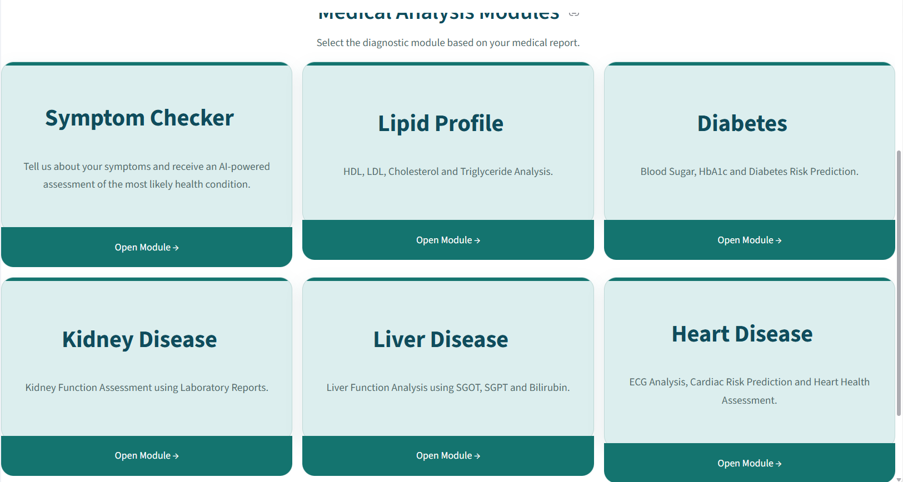

---


</div>

---

# 🎥 Live Demonstration

<p align="center">
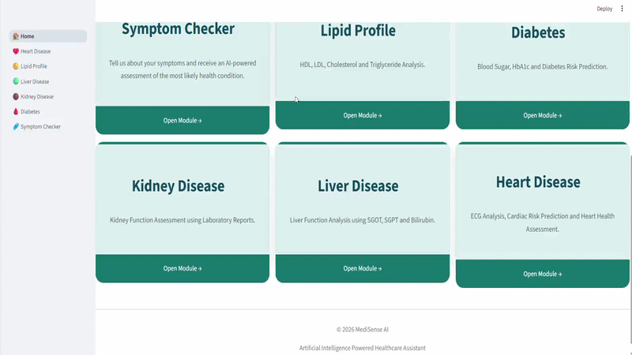
</p>

> The demo showcases disease prediction, medical report analysis, AI-assisted healthcare explanations, and conversational support.

---

# 📑 Table of Contents

- About the Project
- Key Features
- System Architecture
- Complete Workflow
- Project Structure
- Application Modules
- Machine Learning Models
- OCR Pipeline
- AI Healthcare Assistant
- Screenshots
- Technology Stack
- Installation
- Usage
- Future Enhancements
- Developer
- License

---

# 📖 About the Project

Healthcare applications often provide disease prediction but fail to explain results in a way that patients can easily understand. Medical reports contain valuable clinical information, yet many users struggle to interpret laboratory values, understand disease risks, or determine appropriate next steps.

**MediSense AI** bridges this gap by integrating machine learning, OCR technology, and conversational AI into a single intelligent healthcare platform.

The application predicts multiple diseases, extracts information from uploaded medical reports using Optical Character Recognition (OCR), performs lipid profile analysis, provides symptom-based health assessment, and offers an AI-powered medical assistant capable of answering follow-up questions based on prediction results.

Unlike traditional prediction systems, MediSense AI focuses on delivering **understandable**, **interactive**, and **personalized** healthcare guidance while maintaining a modular architecture that supports future expansion.

---

# ✨ Key Features

✅ Heart Disease Prediction

✅ Diabetes Prediction

✅ Kidney Disease Prediction

✅ Liver Disease Prediction

✅ Lipid Profile Analysis

✅ Symptom Checker

✅ Medical Report OCR using pytesseract

✅ AI-powered Healthcare Assistant

✅ Personalized Health Recommendations

✅ Interactive Chat using Groq Llama Models

✅ Clean Streamlit User Interface

✅ Modular Multi-page Architecture

✅ Real-time Prediction Results

✅ Disease Explanation and Follow-up Q&A

---

# 🎯 Objectives

- Predict multiple diseases using Machine Learning.
- Extract medical information from uploaded reports.
- Improve healthcare accessibility using AI.
- Explain medical predictions in simple language.
- Provide personalized recommendations.
- Build a scalable healthcare assistant platform.

---

# 🚀 Application Overview

<p align="center">
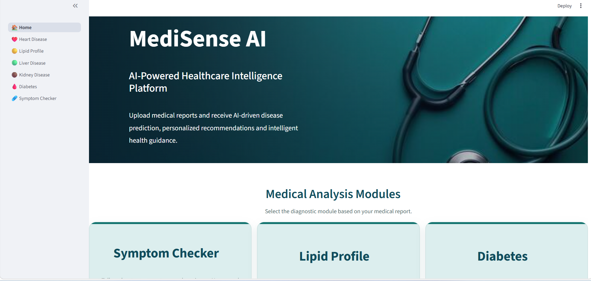
</p>

The application consists of six healthcare modules integrated into a single Streamlit application:

| Module | Description |
|---------|-------------|
| ❤️ Heart Disease | Predicts cardiovascular disease risk |
| 🩸 Diabetes | Predicts diabetes based on clinical parameters |
| 🟤 Kidney Disease | Detects chronic kidney disease |
| 🟢 Liver Disease | Predicts liver disorders |
| 🟡 Lipid Profile | Analyzes cholesterol values and cardiovascular risk |
| 🩹 Symptom Checker | Suggests possible health conditions based on symptoms |

---

# 🏗️ System Architecture

MediSense AI follows a modular architecture where the frontend, machine learning models, OCR engine, and AI assistant work together to provide an end-to-end healthcare solution.

<p align="center">
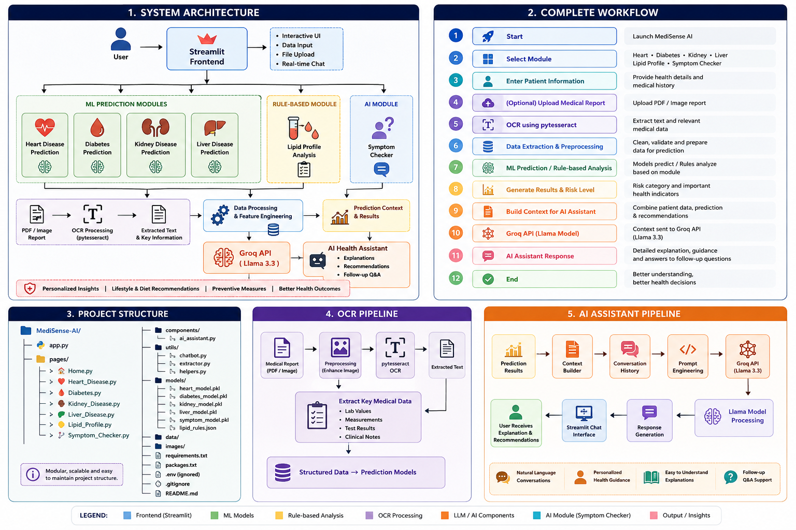
</p>

### Architecture Components

| Component | Description |
|-----------|-------------|
| **Streamlit Frontend** | Interactive web interface for user interaction |
| **Machine Learning Models** | Predict Heart, Diabetes, Kidney and Liver diseases |
| **Rule-based Lipid Analyzer** | Performs cholesterol risk assessment |
| **OCR Engine (pytesseract)** | Extracts text from uploaded medical reports |
| **Groq LLM API** | Generates AI-powered explanations and answers |
| **AI Healthcare Assistant** | Provides personalized recommendations and conversational support |

---

# 🔄 Application Workflow

The application follows the workflow shown below.

<p align="center">

</p>

### Workflow Steps

1. User launches MediSense AI.
2. Selects one of the healthcare modules.
3. Enters patient details.
4. (Optional) Uploads a medical report.
5. OCR extracts text using **pytesseract**.
6. Data is cleaned and preprocessed.
7. Machine Learning or Rule-Based analysis is performed.
8. Prediction results are generated.
9. Prediction context is created.
10. Context is sent to **Groq Llama Model**.
11. AI Assistant explains the results.
12. User asks follow-up healthcare questions.

---

# 📂 Project Structure

The project follows a modular architecture for scalability, maintainability and code reusability.

```text
MediSense-AI/
│
├── app.py
├── requirements.txt
├── packages.txt
├── README.md
├── .gitignore
│
├── images/
│
├── models/
│
├── pages/
│   ├── 🏠 Home.py
│   ├── ❤️ Heart_Disease.py
│   ├── 🩸 Diabetes.py
│   ├── 🟤 Kidney_Disease.py
│   ├── 🟢 Liver_Disease.py
│   ├── 🟡 Lipid_Profile.py
│   └── 🩹 Symptom_Checker.py
│
├── components/
│   └── ai_assistant.py
│
└── utils/
    ├── chatbot.py
    ├── extractor.py
    └── helpers.py
```

### Directory Description

| Folder | Purpose |
|---------|----------|
| **pages/** | Contains all disease prediction modules |
| **models/** | Trained Machine Learning models |
| **utils/** | OCR, chatbot and helper functions |
| **components/** | Reusable Streamlit components |
| **images/** | README screenshots and diagrams |

---

# 💻 Technology Stack

## Programming Language

- Python

## Frontend

- Streamlit

## Machine Learning

- Scikit-learn
- Joblib
- NumPy
- Pandas

## Computer Vision & OCR

- OpenCV
- pytesseract
- Pillow

## Artificial Intelligence

- Groq API
- Llama 3.3

## Data Visualization

- Matplotlib
- Seaborn

## Development Tools

- Visual Studio Code
- Git
- GitHub

---

# 🧠 Machine Learning Modules

The application currently supports six healthcare modules.

| Module | Method |
|---------|---------|
| ❤️ Heart Disease | Machine Learning |
| 🩸 Diabetes | Machine Learning |
| 🟤 Kidney Disease | Machine Learning |
| 🟢 Liver Disease | Machine Learning |
| 🟡 Lipid Profile | Rule-Based Analysis |
| 🩹 Symptom Checker | Machine Learning |

Each prediction module generates health recommendations which are further explained using the integrated AI Assistant powered by Groq Llama models.

---
# 📸 Application Screenshots

The following screenshots demonstrate the major functionalities of **MediSense AI**.

---

# 🏠 Home Page

The home page provides an overview of the application, available healthcare modules, and quick navigation to disease prediction services.

<p align="center">
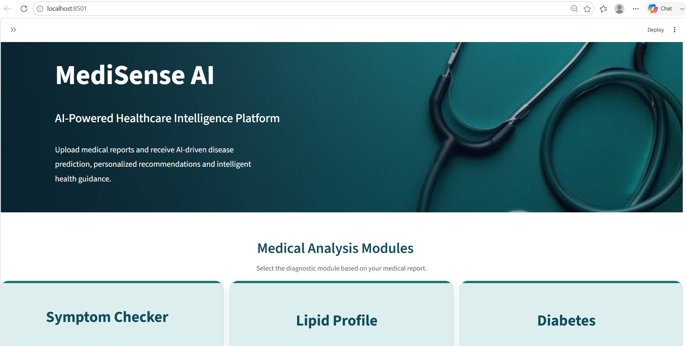

</p>

---

# 📂 Navigation Sidebar

The sidebar allows users to quickly navigate between healthcare modules.

<p align="center">

</p>

---

# ❤️ Heart Disease Prediction

The Heart Disease module predicts the likelihood of cardiovascular disease using patient clinical information.

## Patient Input

<p align="center">
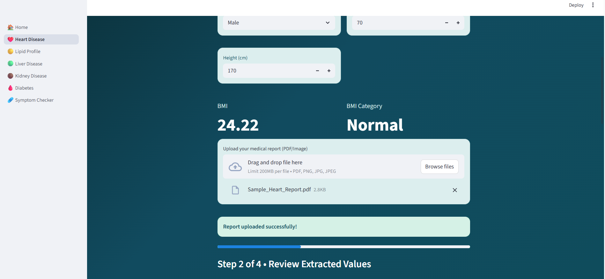
</p>

---

## Prediction Result

The application displays prediction results along with recommendations and health guidance.

<p align="center">
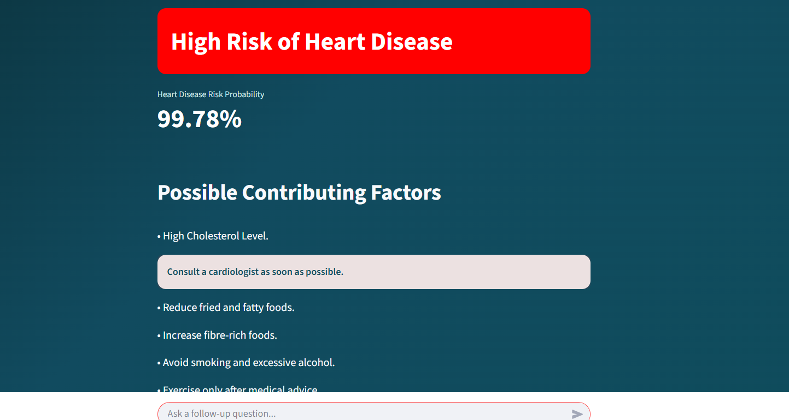
</p>

---

## AI Healthcare Assistant

Users can ask follow-up questions regarding their prediction.

<p align="center">
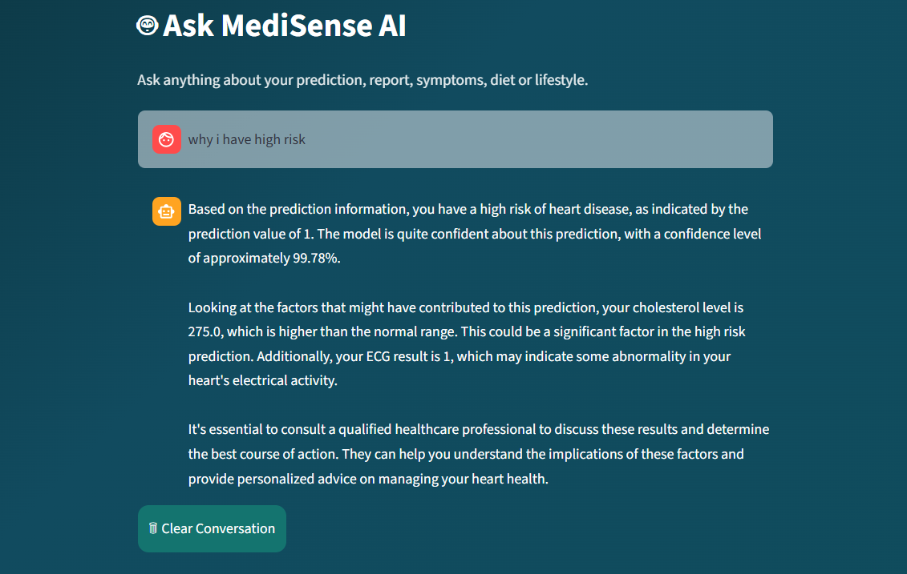
</p>

---

## Feature Correlation Heatmap

<p align="center">
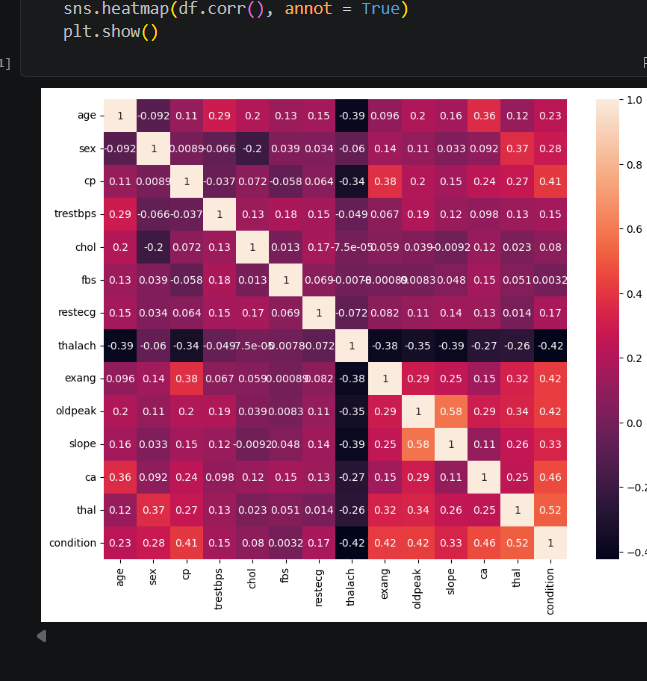
</p>

---

## Confusion Matrix

<p align="center">
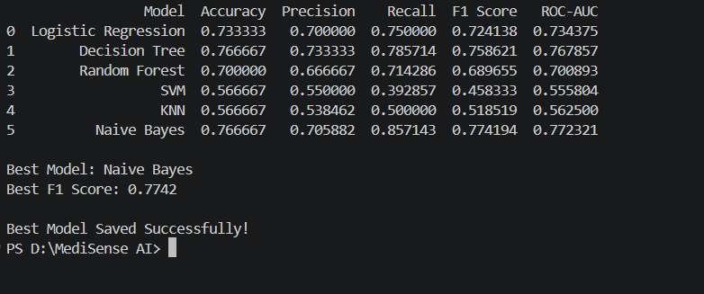
</p>

---

# 🩸 Diabetes Prediction

The Diabetes Prediction module evaluates diabetes risk based on patient health parameters.

## Prediction Result

<p align="center">
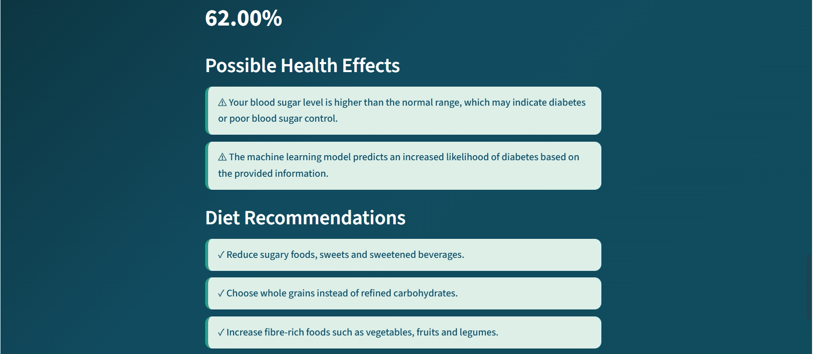
</p>

---

## Confusion Matrix

<p align="center">
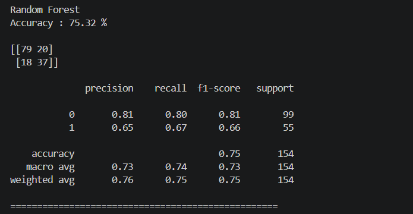
</p>

---

# 🟤 Kidney Disease Prediction

The Kidney Disease module predicts chronic kidney disease using laboratory and clinical features.

## Prediction Result

<p align="center">
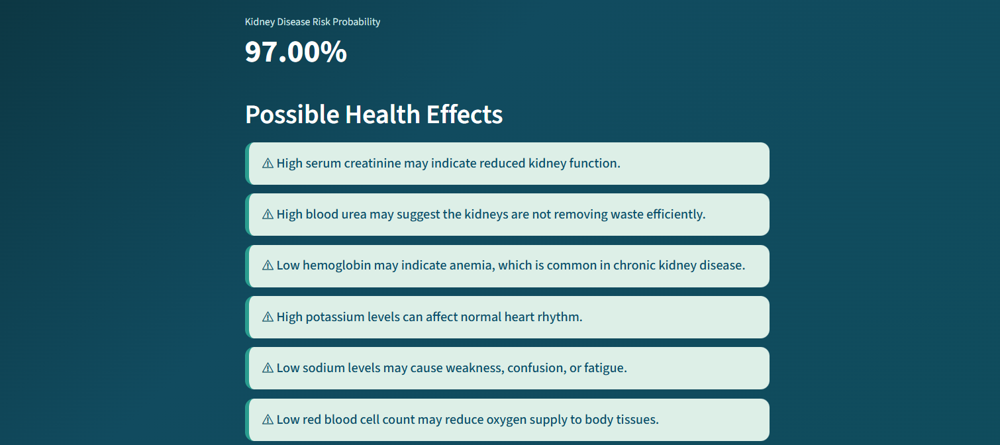
</p>

---

## Confusion Matrix

<p align="center">
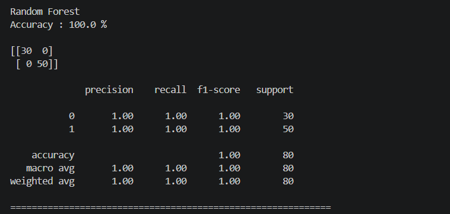
</p>

---

# 🟢 Liver Disease Prediction

The Liver Disease module predicts liver disorders using patient medical information.

## Prediction Result

<p align="center">
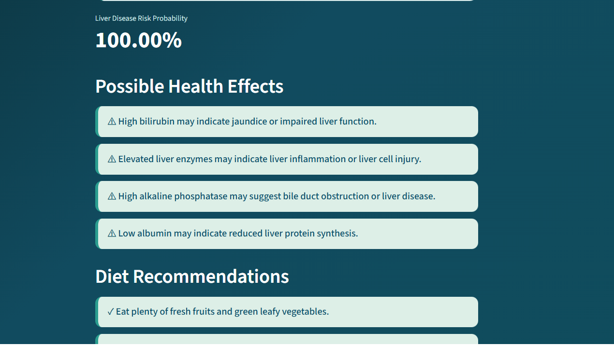
</p>

---

## Confusion Matrix

<p align="center">
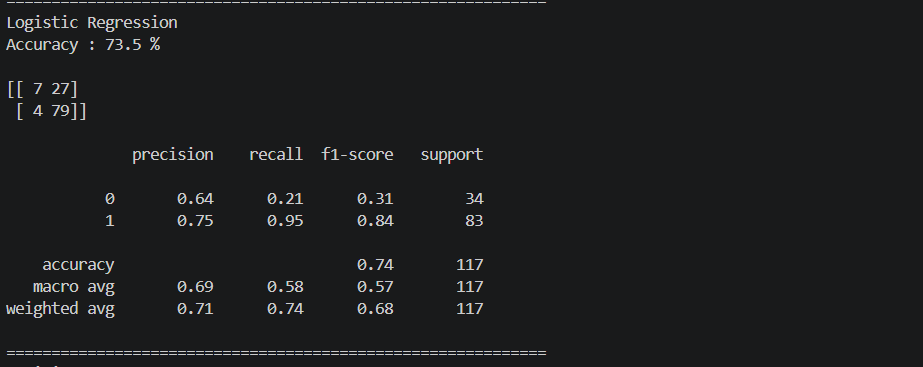
</p>

---

# 🟡 Lipid Profile Analysis

The Lipid Profile module performs rule-based analysis of cholesterol values and cardiovascular risk.

<p align="center">
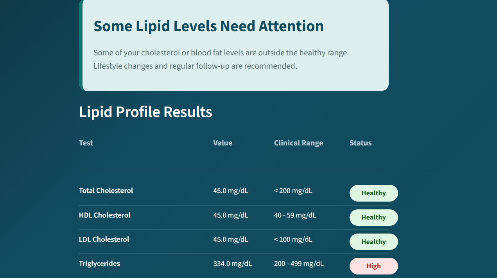
</p>

---

# 🩹 Symptom Checker

The Symptom Checker predicts possible health conditions based on user-selected symptoms.

## Symptom Selection

<p align="center">
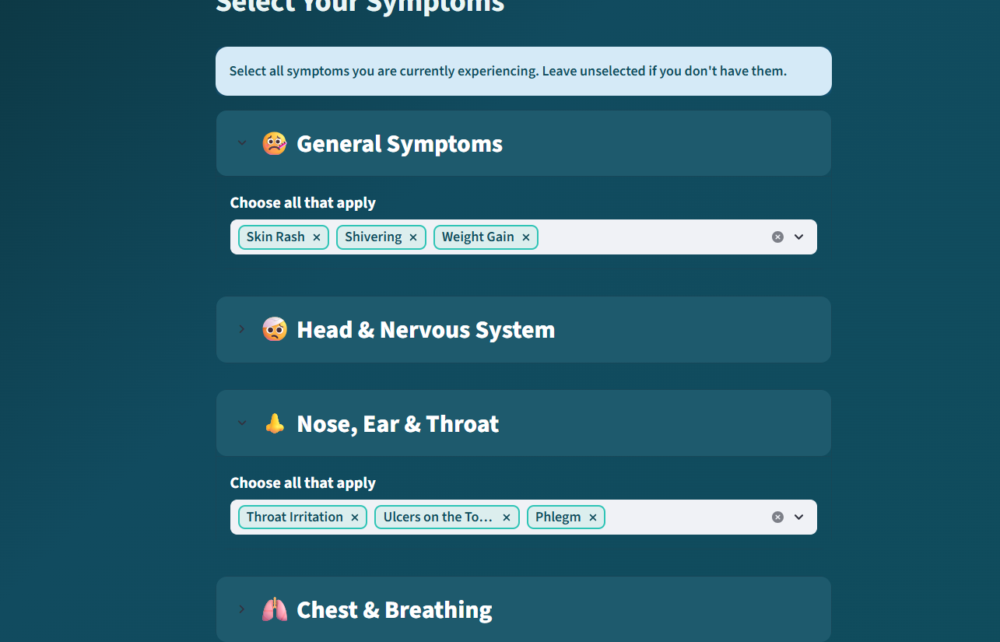
</p>

---

## Prediction Result

<p align="center">
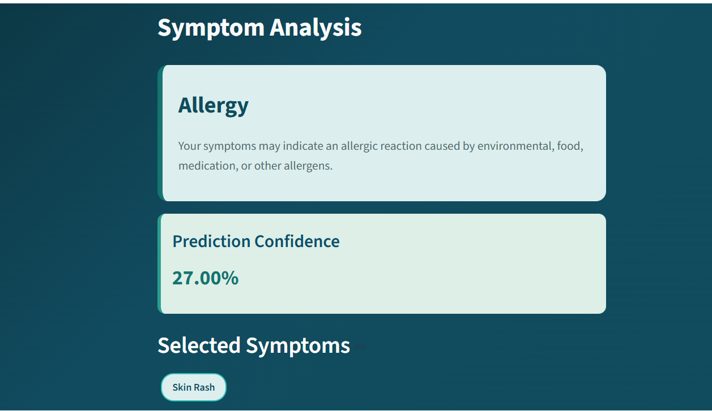
</p>

---

## Confusion Matrix

<p align="center">
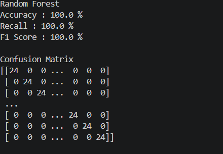
</p>

---

# 🤖 AI Healthcare Assistant

The AI Assistant is integrated into each prediction module and provides:

- Disease explanations
- Lifestyle recommendations
- Medical guidance
- Follow-up question answering
- Personalized healthcare assistance

<p align="center">
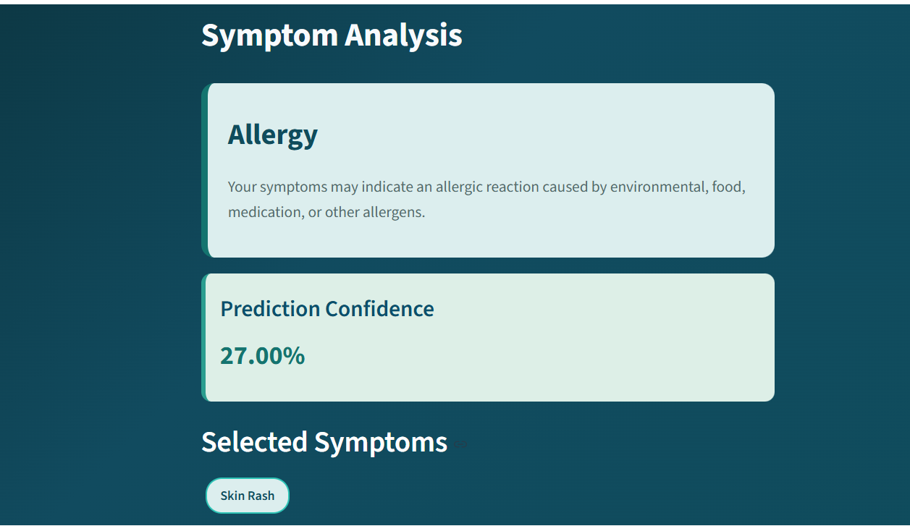
</p>

---
# 🔍 Optical Character Recognition (OCR)

MediSense AI supports automatic extraction of text from uploaded medical reports using **pytesseract OCR**.

## OCR Workflow

- Upload a medical report (Image/PDF)
- Extract text using Tesseract OCR
- Identify important medical values
- Send extracted information for prediction
- Generate AI-assisted explanation

### OCR Features

- Medical report text extraction
- Laboratory value identification
- Automatic preprocessing
- Integration with prediction modules
- AI-assisted report explanation

---

# 🤖 AI Healthcare Assistant

One of the key features of MediSense AI is the integrated AI Healthcare Assistant powered by **Groq Llama 3.3**.

Unlike traditional healthcare prediction systems that only display results, MediSense AI explains predictions in natural language and allows users to ask follow-up questions.

## Capabilities

- Explain disease predictions
- Interpret medical terminology
- Lifestyle recommendations
- Diet suggestions
- Preventive measures
- Answer follow-up questions
- Personalized healthcare guidance

---

# 📊 Model Performance

| Module | Algorithm | Output |
|---------|-----------|--------|
| ❤️ Heart Disease | Machine Learning | Disease Prediction |
| 🩸 Diabetes | Machine Learning | Diabetes Prediction |
| 🟤 Kidney Disease | Machine Learning | CKD Prediction |
| 🟢 Liver Disease | Machine Learning | Liver Disease Prediction |
| 🟡 Lipid Profile | Rule-Based Analysis | Cholesterol Risk Analysis |
| 🩹 Symptom Checker | Machine Learning | Possible Disease Prediction |

---

# ⚡ Installation

## Clone Repository

```bash
git clone https://github.com/shiwangiedulearn-jpg/MediSense-AI.git

cd MediSense-AI
```

---

## Create Virtual Environment

### Windows

```bash
python -m venv venv
venv\Scripts\activate
```

### Linux / Mac

```bash
python3 -m venv venv

source venv/bin/activate
```

---

## Install Dependencies

```bash
pip install -r requirements.txt
```

---

## Install Tesseract OCR

### Windows

Download and install

https://github.com/UB-Mannheim/tesseract/wiki

### Linux

```bash
sudo apt install tesseract-ocr
```

---

## Configure Environment Variables

Create a **.env** file.

```env
GROQ_API_KEY=your_api_key_here
```

---

## Run Application

```bash
streamlit run app.py
```

---

# ▶️ Usage

1. Launch the Streamlit application.
2. Choose a healthcare module.
3. Enter patient details.
4. Upload a report if available.
5. Generate prediction.
6. Read recommendations.
7. Ask the AI Assistant follow-up questions.

---

# 📈 Future Enhancements

- PDF medical report parser
- Multiple language support
- Doctor dashboard
- Patient history management
- Cloud deployment
- User authentication
- Appointment scheduling
- Voice Assistant
- Mobile application
- Integration with wearable devices

---

# 🛠 Tech Stack

| Category | Technologies |
|----------|--------------|
| Programming | Python |
| Frontend | Streamlit |
| Machine Learning | Scikit-learn |
| OCR | pytesseract |
| Computer Vision | OpenCV |
| Data Processing | Pandas, NumPy |
| Visualization | Matplotlib, Seaborn |
| LLM | Groq API (Llama 3.3) |
| Version Control | Git & GitHub |

---

# 📌 Key Highlights

✔ Multi-Disease Prediction

✔ AI Healthcare Assistant

✔ Medical Report OCR

✔ Rule-Based Lipid Analysis

✔ Symptom Checker

✔ Interactive Chat

✔ Modular Architecture

✔ Real-time Predictions

✔ Personalized Recommendations

✔ User-friendly Interface

---

# 👩‍💻 Developer

**Shiwangi Rana**

B.Tech Computer Science Engineering

Artificial Intelligence & Machine Learning Enthusiast

---

# 🙏 Acknowledgements

Special thanks to the open-source community and the developers of:

- Streamlit
- Scikit-learn
- OpenCV
- pytesseract
- Groq
- Llama Models
- Pandas
- NumPy
- Matplotlib

---

# 📄 License

This project is developed for **educational and research purposes**.

Feel free to fork, improve and contribute.

---

<div align="center">

## ⭐ If you like this project, don't forget to Star the repository!

Made with ❤️ using Python, Streamlit, Machine Learning, OCR and Generative AI.

</div>